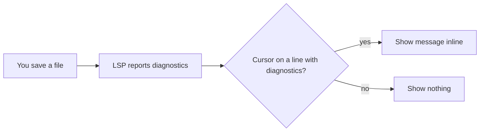
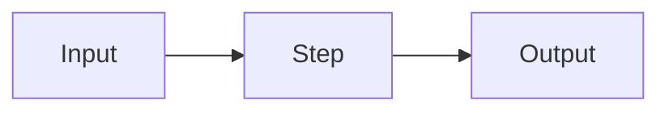

# README

Goal: in 10 seconds the reader knows what the project does; in 2 minutes they
have it installed and running.

## Before writing

- Read the code, not only the old README: manifest (`pyproject.toml`,
  `package.json`, `Cargo.toml`, rockspec…), entry points, CLI `--help`,
  config defaults, public API, CI workflows.
- Every fact comes from the repo. If something is unknown (minimum version,
  install name), ask once or leave `TODO:`. Never guess.
- Rewriting: keep what is correct; drop what is stale.

## Structure

Include a section only when it has real content. In this order:

1. **Title**: `# name`, then one sentence saying what it does. Add who it is
   for only if not obvious.
2. **Badges**: only real ones (CI, required runtime/version), 3 max.
3. **How it works**: a mermaid flow diagram (see below), when applicable.
4. **Table of contents**: only past ~6 sections.
5. **Requirements**: bullets with exact versions.
6. **Installation**: copy-pasteable snippet per package manager. The minimal
   snippet must work as-is.
7. **Usage**: smallest working example first, then one example per real
   feature. Long configs go in `<details>`.
8. **Configuration**: the full default config in one code block, taken from
   the source defaults, with a short inline comment per option.
9. **API / Commands**: signature or command, one line each.
10. **Optional**: anything else specific to this project that a user would
    need, such as integrations, known limitations, troubleshooting or a
    comparison with the obvious alternative. Each one gets its own section,
    only if the repo gives it real content.

No License section, no screenshots or GIFs.

## Flow diagram

Shows what happens from the user's point of view: what goes in, what the
project does with it, what comes out. Not modules, classes or files.

- Add it only when there is a real flow: several steps, a branch, or
  several actors (user, tool, external service). Skip it for a library whose
  usage is one call.
- `flowchart LR` for a pipeline, `sequenceDiagram` when timing between
  actors matters.
- 10 nodes max. Labels in the user's words ("diagnostic appears",
  "config file read"), not function names.
- One sentence above it, nothing below. The diagram must match the code: if
  a step isn't in the source, it isn't in the diagram.

Example for an inline-diagnostics plugin:



## Writing rules

- Show, don't tell: a code block beats a sentence, a sentence beats an
  adjective.
- Imperative and present tense: "Run", "Set", "Returns". No "we".
- Paragraphs of 3 sentences max. Headings are plain nouns: "Installation",
  not "🚀 Getting Started".
- Code blocks have a language tag, run as-is and use real names from the code.
- Callouts (`> [!NOTE]`, `> [!IMPORTANT]`, `> [!WARNING]`) only for things
  that break the setup if missed. 3 max.
- Numbers over claims. No number measured, no claim.

## Banned

- Words: seamless, effortless, robust, powerful, blazing/lightning fast,
  cutting-edge, state-of-the-art, comprehensive, elevate, supercharge,
  unleash, empower, leverage, streamline, delightful, intuitive,
  game-changer, next-generation, simply, just, easily.
- Openers: "Welcome to…", "This project aims to…", "Whether you're a
  beginner or an expert…", "Look no further", "Say goodbye to…".
- Emoji on headings or bullets. One emoji in the title at most, and only if
  the project already uses it.
- "✨ Features" lists of adjectives. A feature list is allowed only if each
  item is a concrete capability.
- "Built with ❤️", star begging, boilerplate Contributing, Code of Conduct
  or Support sections, acknowledgements nobody asked for.
- Restating the title in the intro, summarizing the README at the end,
  roadmaps or "coming soon".
- Placeholder links, fake badges, invented benchmarks, stock images.

## Before delivering

- Run or check every command and snippet against the repo.
- Check every option in Configuration exists in the source with that default.
- Check every link resolves.
- Check the mermaid block parses
  (`npx -p @mermaid-js/mermaid-cli mmdc -i README.md -o /tmp/out.md`).
- Search the draft for the banned list and remove every hit.
- Delete any sentence whose removal loses no information.

## Skeleton

````markdown
# name

One sentence: what it does.

## How it works

One sentence.



## Requirements

- Runtime >= X.Y

## Installation

```sh
<install command>
```

## Usage

```lang
<smallest working example>
```

## Configuration

```lang
<full defaults, one comment per option>
```
````

